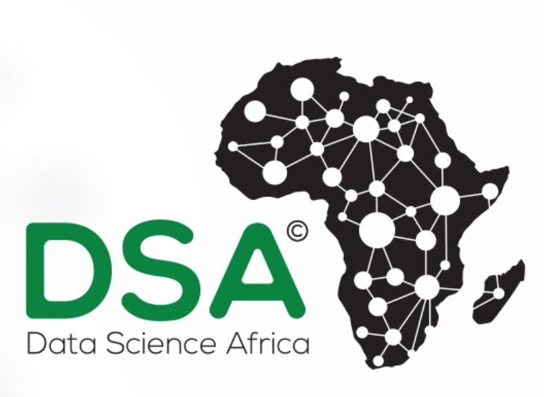

# NaijaHate: Offensive Language and Hate Speech Detection in Nigerian Languages

## Introduction
NaijaHate is a pioneering project aimed at addressing the growing problem of online offensive and hate speech in Nigeria. This project introduces the first labeled dataset for offensive and hate speech detection in three major Nigerian languages. Our goal is to aid in content moderation, social media monitoring, and threat evaluation through machine learning tools.

## Table of Contents
- [Project Description](#project-description)
- [Dataset](#dataset)
- [Lexicon](#lexicon)
- [Research Paper](#research-paper)
- [Hugging Face Model Link](#hugging-face-model-link)
- [Project Sponsors](#project-sponsors)
- [Contributing](#contributing)
- [License](#license)
- [Contact](#contact)

## Project Description
The Offensive and Hate Speech Detection Project aims to tackle the pervasive issue of offensive and hateful content circulating in Nigeria's digital spaces. Leveraging state-of-the-art Natural Language Processing (NLP) techniques, the project seeks to develop robust algorithms and tools capable of automatically identifying and mitigating instances of hate speech across the three major languages spoken in Nigeria.

### Challenges Faced in Nigeria and the Role of Hate Speech Detection Projects

1. **Cultural Diversity**: Nigeria boasts over 250 ethnic groups, each with distinct languages and customs. This diversity can sometimes lead to tensions exacerbated by offensive or hateful speech. Offensive and Hate speech detection projects can help identify and mitigate such instances, fostering understanding among Nigeria's diverse population.

2. **Linguistic Variation**: With over 500 languages spoken, linguistic diversity poses a challenge for automated text analysis. Hate speech detection models must accurately identify offensive language across multiple languages and dialects, necessitating development in various Nigerian languages.

3. **Legal and Regulatory Framework**: Nigeria has laws against hate speech, but enforcement can be difficult, especially online. Hate speech detection projects can complement legal frameworks by aiding in the identification and reporting of hate speech instances, supporting law enforcement efforts.

4. **Ethical Considerations**: Hate speech detection projects must navigate ethical issues including privacy, censorship, and bias. Algorithms must be fair, transparent, and culturally sensitive, ensuring that legitimate expression is not suppressed.

## Dataset

The NaijaHate dataset is a dedicated effort to curate a comprehensive dataset for hate speech detection across three major Nigerian languages: Hausa, Yoruba, and Igbo. This dataset was collected using the Twitter Academic API.  By providing this dataset, we aim to facilitate research and development in the field of natural language processing, specifically in the context of hate speech detection in African languages.

The dataset is freely available for researchers and can be accessed for academic and research purposes. This project aims to promote a safer online environment.

Link to dataset: [Dataset](https://github.com/smaliyu/NaijaHate/tree/main/Datasets)

## Lexicon
At the outset of the NaijaHate project, we curated hate speech lexicons for each of the major Nigerian languages. These lexicons played a crucial role in our data collection process, particularly in the collection of tweets in all the languages. The lexicons are comprehensive and tailored to the linguistic nuances of each language, ensuring effective identification of offensive and hate speech.

You can access the lexicons for all the languages in the [Lexicons folder](https://github.com/smaliyu/NaijaHate/blob/main/Data%20Sampling%20strategy_.pdf).

  
## Research Paper

We have successfully published a paper titled "" that details the methodologies, findings, and implications of our project. This paper serves as a cornerstone in our efforts to understand and combat online hate speech in Nigerian languages. Link to the published paper: [Published Paper](<link-to-published-paper>)

We are also excited to announce that we are currently working on a second paper titled "xx", which aims to build upon our initial findings and explore new dimensions of hate speech detection.

## Project Sponsors 

We express our profound gratitude to Data Science Africa for their generous support in funding this project. Their commitment to advancing data science and machine learning across Africa has been instrumental in making NaijaHate a reality. This grant has enabled us to tackle the critical issue of hate speech in Nigerian languages, fostering a safer online environment.

## Contact 

For additional information, inquiries, or collaboration opportunities related to the NaijaHate project, please feel free to reach out to our Project Lead, Saminu Muhammad. He can be contacted via email at [saminualiyu@gmail.com](mailto:saminualiyu@gmail.com). Your interest and support for our initiative are greatly appreciated, and we look forward to engaging with the community.
